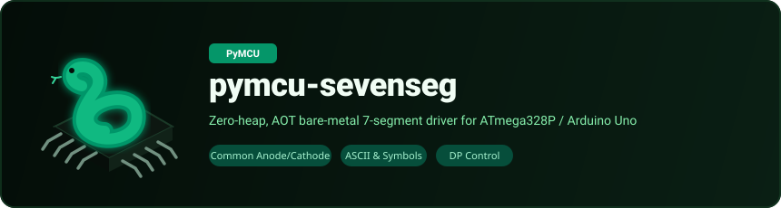

# pymcu-sevenseg
<p align="center">
  
</p>

A PyMCU library for controlling a single-digit 7-segment display on bare-metal AVR (Arduino Uno / ATmega328P) firmware  no interpreter, no runtime, compiled straight to machine code.

Supports Common Anode and Common Cathode displays, digits 0–9, most A–Z / a–z letters that are renderable on a 7-segment display, common symbols, and an optional decimal point (DP).

- **Author:** Kritish Mohapatra
- **License:** MIT
- **Year:** 2026

*Ported from the original `micropython-sevenseg` library to PyMCU's statically-typed Python subset. Validated on real Arduino Uno hardware via `pymcu build` and `pymcu flash`.*

---

## Installation

```bash
pip install --pre pymcu-sevenseg
```

## Wiring

Connect each segment pin (a–g) through a current-limiting resistor (220–330Ω) to a digital pin on the Arduino Uno. Connect the display's common pin(s) to GND (common cathode) or 5V (common anode).

| Segment | Example Pin (Uno) |
|---------|--------------------|
| a       | Pin 2              |
| b       | Pin 3              |
| c       | Pin 4              |
| d       | Pin 5              |
| e       | Pin 6              |
| f       | Pin 7              |
| g       | Pin 8              |
| dp      | Pin 9 (optional)   |

## Usage

```python
from machine import Pin
from utime import sleep_ms
from sevenseg import SevenSeg

def main():
    # Common Cathode configuration with DP on Pin 9
    display = SevenSeg(2, 3, 4, 5, 6, 7, 8, pin_dp=9, has_dp=True, common_anode=False)

    count: uint8 = 0
    while True:
        display.show(count)
        sleep_ms(1000)
        count = count + 1
        if count > 9:
            count = 0
```

## API Reference

### `SevenSeg(pin_a, pin_b, pin_c, pin_d, pin_e, pin_f, pin_g, pin_dp=0, has_dp=False, common_anode=False)`

Creates a display driver instance. All pin arguments must be compile-time constant integers (`const[uint8]`).

- `pin_a` ... `pin_g` — Segment pin numbers.
- `pin_dp` — Decimal point pin number. Ignored unless `has_dp=True`.
- `has_dp` — Whether a decimal point pin is wired (`True` / `False`).
- `common_anode` — `True` for Common Anode displays, `False` (default) for Common Cathode.

### `show(digit, dp=False)`

Displays a character. Accepts either a plain numeric digit (0–9) or an ASCII code (`uint8`).

- **Digits:** 0–9 (or ASCII 48–57).
- **Letters:** Most renderable uppercase and lowercase characters (e.g. `ord('A')` / 65, `ord('b')` / 98). Note: characters like K, M, V, W, X cannot be rendered clearly on 7 segments and are skipped.
- **Symbols:** `- _ . ! ? ' " [ ] = + ^` and space.
- `dp` — Turn the decimal point on for this character (active only when `has_dp=True`). Note: characters `.` and `!` automatically enable the decimal point.

### `clear()`

Turns off all segments and the decimal point immediately.

## Notes & Constraints

- **Compile-Time Pin Constants:** Pin numbers must be literals known at compile time — this is a PyMCU language constraint (compile-time pin resolution), not a driver limitation.
- **Zero-Heap Design:** Does not allocate dynamic memory on the heap; compiles directly to efficient static AVR assembly instructions.
- **Backend Compatibility:** Tested and verified with `pymcu-compiler[avr]` (beta as of `0.1.0a10`).